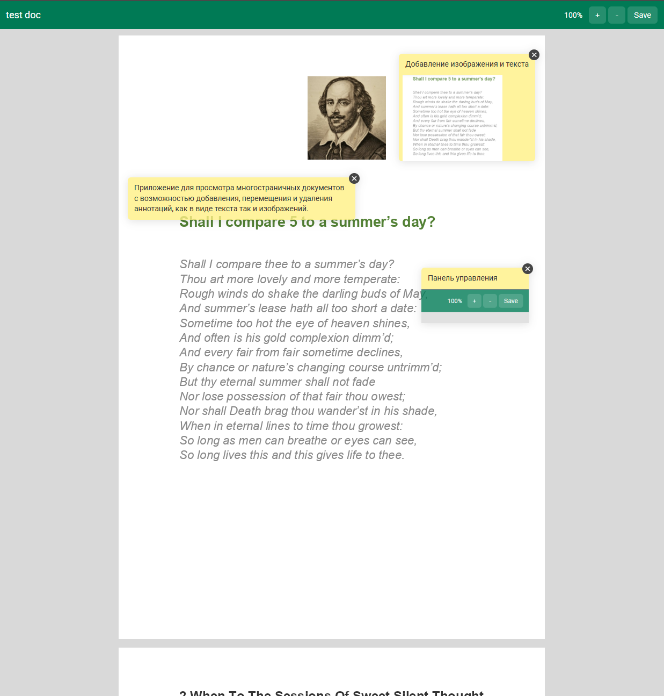

# Тестовое Clearway - Приложение для просмотра документов и добавления аннотаций

Приложение для просмотра многостраничных документов с возможностью добавления, перемещения и удаления аннотаций, как в виде текста так и изображений.




## Запуск

```bash
npm install
npm start
```

Откроется на `http://localhost:4200` и автоматически перенаправит на `/document/1`.

---

## Архитектура

```text
src/app/
├── core/               # Доменные модели, DTO, API-сервисы
├── features/
│   └── document-viewer/
│       ├── components/ # UI-компоненты фичи
│       ├── directives/ # DraggableDirective, ZoomImageDirective
│       ├── resolvers/  # Предзагрузка документа (ResolveFn)
│       ├── services/   # AnnotationService, ZoomImageService
│       └── document-viewer.routes.ts
└── shared/             # Переиспользуемые утилиты (PercentagePipe)
```

**Управление состоянием:** только Angular Signals (`signal`, `computed`), никакого RxJS в компонентах и `async pipe`.
Все компоненты standalone с `ChangeDetectionStrategy.OnPush`.

---

## Плюсы архитектуры и структуры

### Структура проекта

- Feature-based разбивка. Каждая фича самодостаточна: компоненты, директивы, сервисы и роутинг расположены рядом, не размазаны по глобальным папкам
- Явное разделение `core` / `features` / `shared`. Понятно, где доменные модели, где фича-специфичный код, где переиспользуемые утилиты
- `document-viewer.routes.ts` внутри фичи. Роутинг инкапсулирован, фичу можно перенести или переименовать без затрагивания `app.routes.ts`
- Lazy loading через `loadChildren` + `loadComponent`. Фича не грузится до навигации, бандл разделён по умолчанию

### Angular-паттерны

- Signals + `computed()` как единственный механизм состояния, без подписок, без `async pipe`, без ручной очистки
- Все компоненты standalone с `OnPush`,  предсказуемое обнаружение изменений
- Функциональный `inject()` вместо конструкторной инъекции
- Функциональный resolver (`ResolveFn`) вместо класса
- `DOCUMENT` injection token вместо прямого `window`,совместимость с SSR
- С Angular 21 zoneless включен по дефолту, а так как приложение на сигналах zode.js можно удалить из зависимостей, меньше бандл

---


## Функциональные плюсы реализации

- При зуме аннотация также учитывает коэффициент зума и поэтому не прыгает относительно страницы
- Учтены границы страницы для перемещения аннотации
- В раках проекта хранение аннотаций `AnnotationService`, в дальнейшем, если будет отдельный api метод для получения аннотаций можно быстро его реализовать, не затрагивая сущности страницы

## Улучшения, которые можно было бы реализовать дополнительно

- Производительность при больших объемах странниц и аннотаций можно реализовать через virtual scroll
- Отдельный `api` метод для фетчинга аннотаций, когда страница попадает во viewport
- Редактирование аннотаций
- Валидации для аннотаций
- Покрытие тестами (Важный сервис с аннотациями покрыт unit тестами `annotation.service.spec.ts`)
